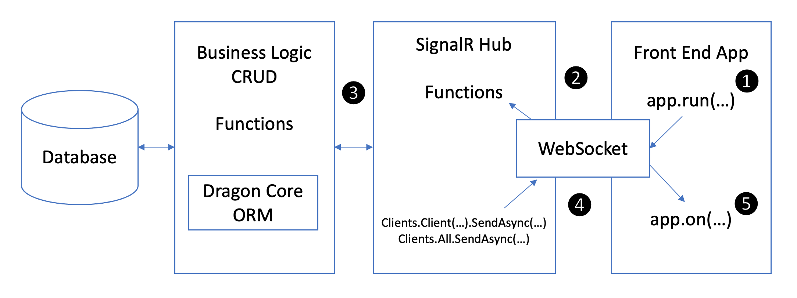

# AppRun .NET Core SignalR Demo

This is a demo application using the SignalR as backend and [AppRun](https://github.com/yysun/apprun) as front end.

If needed, you can use the [Dragon Core ORM](https://github.com/yysun/dragon-core) to access the SQL database.

* Open the project in Visual Studio Code
* Run _npm install_ under the _client_ folder
* Click F5 to start the back end
* Use _npm start_ to start the front end
* Use _npm run build_ to build for production

Have fun.

(C) Copyright 2020, Yiyi Sun

